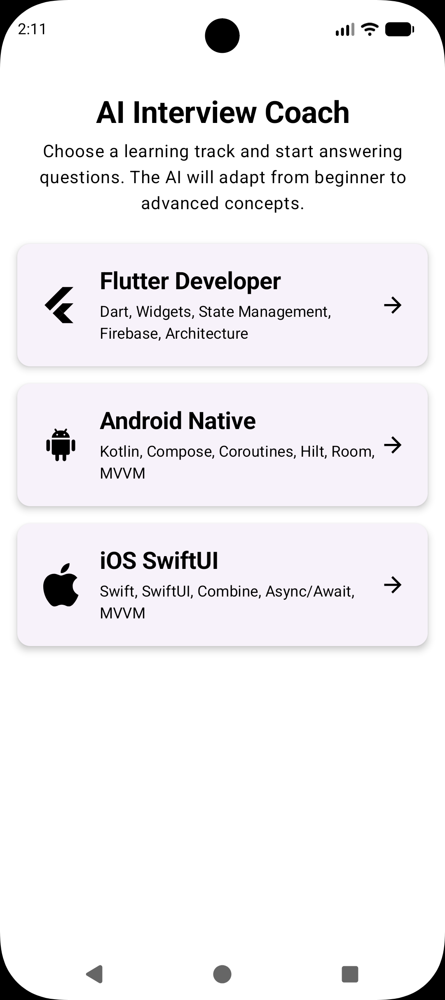
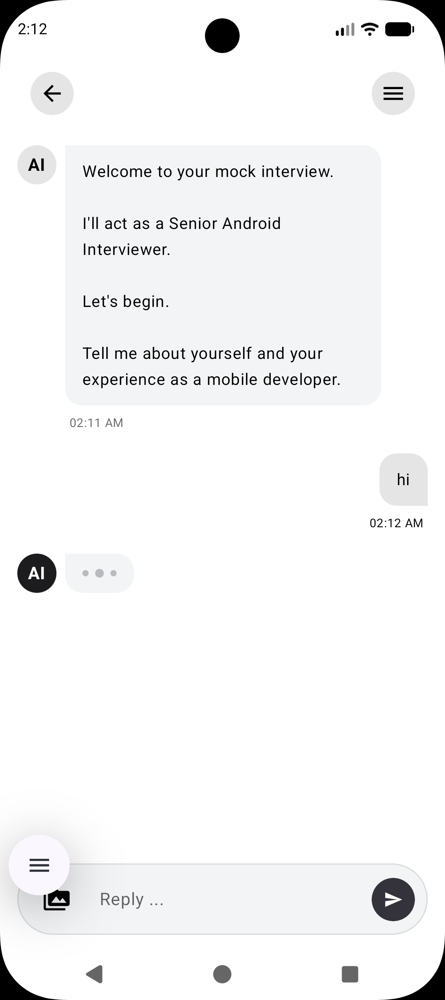
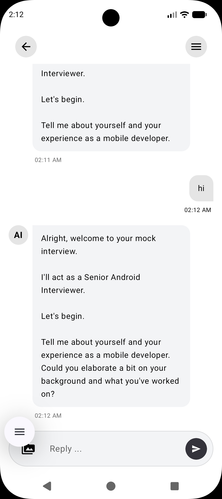

# AI Interview Coach

An AI-powered mobile application that helps developers and job seekers practice technical interviews through realistic conversational simulations.

Built using **Kotlin**, **Jetpack Compose**, **MVVM Architecture**, and **Google Gemini AI**, the app provides personalized interview experiences across multiple technology tracks such as Flutter, Android, React, Backend, and more.

---

## ✨ Features

### 🎯 Multiple Interview Tracks

Choose from different technical domains:

* Flutter Development
* Android Development
* IOS Development

### 🤖 AI-Powered Interviewer

* Dynamic interview questions generated by AI
* Context-aware follow-up questions
* Realistic interview conversation flow
* Adaptive difficulty based on responses

### 💬 Interactive Chat Experience

* Modern chat interface built with Jetpack Compose
* Real-time AI responses
* Conversation history support
* Persistent interview sessions

### 📊 Interview Assessment

* Performance evaluation
* Strength and weakness identification
* Improvement suggestions
* Detailed feedback generation

### 🎨 Modern UI

* Material 3 Design
* Dark & Light Theme Support
* Responsive layouts
* Smooth animations

### 💾 Local Storage

* Save interview history locally
* Resume previous sessions
* Offline access to past interviews

---

## 🛠️ Tech Stack

### Android

* Kotlin
* Jetpack Compose
* Material 3
* Navigation Compose
* ViewModel

### Architecture

* MVVM (Model-View-ViewModel)
* State Management with Compose State
* Repository Pattern

### AI

* Google Gemini API

### Storage

* Local JSON Persistence
* Android File Storage

---

## 📱 Screenshots

| Track Selection | Interview Chat | Settings & Theme Selection |
| :---: | :---: | :---: |
|  |  |  |

---

## 🚀 Getting Started

### Prerequisites

* Android Studio Hedgehog or newer
* JDK 17+
* Android SDK 24+

### Installation

1. Clone the repository

```bash
git clone https://github.com/heyparth11/interview-coach.git
```

2. Open the project in Android Studio

3. Add your Gemini API key

Create a `local.properties` file:

```properties
GEMINI_API_KEY=YOUR_API_KEY
```

4. Build and run

---

## 📂 Project Structure

```text
app/src/main/java/com/example/viewcoach/
├── MainActivity.kt                  # App entry point with navigation host
├── ViewCoachApplication.kt          # Hilt Application class
│
├── data/
│   └── repository/
│       └── GeminiRepo.kt            # Repository implementing Google Gemini API calls
│
├── domain/
│   └── model/
│       ├── ChatMessage.kt           # Data model representing chat messages
│       ├── Evaluation.kt            # Model representing track rating & feedback
│       └── Sender.kt                # Sender enum (USER / ASSISTANT)
│
├── presentation/
│   └── QuestionScreen/
│       ├── ChatScreen.kt            # Chat interface screen
│       ├── TrackSelectionScreen.kt  # Interview track selection screen
│       └── ViewModel.kt             # Shared ViewModel utilizing repo and Hilt
│
└── ui/
    └── theme/
        ├── AppColors.kt             # Custom color class for theme properties
        ├── Theme.kt                 # ViewCoachTheme configuring MaterialTheme colors
        └── Color.kt                 # Light/Dark hex color palette constants
```

---

## 🎯 Use Cases

* Interview preparation
* Technical skill assessment
* Communication practice
* Mock interview simulations
* Career development

---

## 🔒 Privacy

All interview conversations are stored locally on the device. No personal interview data is shared with third parties.

---

## 🗺️ Future Roadmap

* Voice-based interviews
* Speech-to-text support
* Multi-language interviews
* Interview analytics dashboard
* Resume analysis
* Company-specific interview preparation
* Export interview reports
* Cloud synchronization

---

## 🤝 Contributing

Contributions, issues, and feature requests are welcome.

Feel free to submit a pull request or open an issue.

---

## 📄 License

This project is licensed under the MIT License.

---

### Made with ❤️ using Kotlin, Jetpack Compose, and AI
